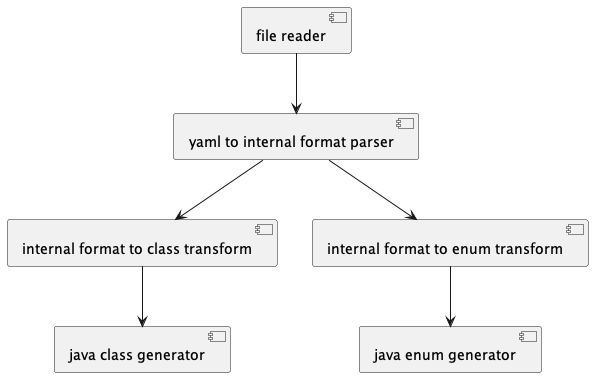
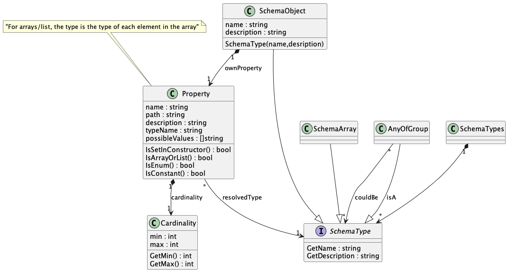
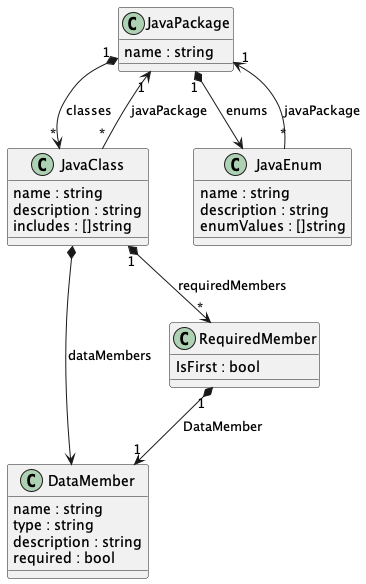

# openapi2beans

This is a golang tool to convert bean structures found in an `openapi.yaml` file into java transport beans, for use in the Galasa server.

We do this to make sure that the java code uses the exact same structure as the `openapi.yaml` declares.

During the build of the framework project, the `openapi.yaml` file is obtained, and java transport beans rendered.

## How to build
Run this script:
```
./build-locally.sh
```
## How to run
```
./bin/openapi2beans-${operatingSystem}-${hardwareArchitecture} generate \
  --yaml ${yamlPath} \
  --output ${outputPath} \
  --package ${outputPackage}
```

Where **operatingSystem** is `darwin` or `linux`,
**hardwareArchitecture** is `x86_64` or `arm64`,
**yamlPath** is the location of the yaml you wish to generate from is,
**outputPath** is the location of the java project you wish to generate to,
and **outputPackage** is the java package you wish the generated code to be located in, the program auto-generates the files to match this.
**Please note that the output package folder is deleted when generating**

For example:
```
./bin/openapi2beans-darwin-arm64 generate \
  --yaml myRestApiDefinition.yaml \
  --output temp/generated \
  --package dev.galasa.framework \
```

## Design
The tool is split into several parts:
- read the yaml file from disk into memory
- convert the yaml data into a set of `SchemaType` in-memory objects
- for each in-memory `SchemaType` object...
    - convert the `SchemaType` in-memory object into a `.java` file image in memory
    - write the in-memory java file image to disk
- Report overall status

The overall design can be split into components:


The intermediate in-memory structures look like this:


The generators use templates, and these data structures:

